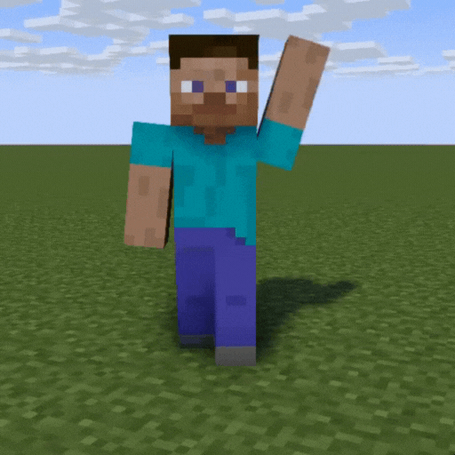

# Ogulniega Modrinth Mod Downloader

**Ogulniega Modrinth Mod Downloader** to prosta aplikacja desktopowa umożliwiająca pobieranie modów z platformy [Modrinth](https://modrinth.com) za pomocą interfejsu graficznego. Stworzona z wykorzystaniem Electron, HTML, CSS i JavaScript, aplikacja oferuje intuicyjny sposób na zarządzanie modami do Minecrafta.



## Funkcje

- **Wyszukiwanie modów**: Przeszukuj bazę modów dostępnych na Modrinth.
- **Pobieranie modów**: Pobieraj wybrane mody bezpośrednio na swój komputer.
- **Przyjazny interfejs**: Korzystaj z prostego i intuicyjnego interfejsu użytkownika.

## Wymagania

- [Node.js](https://nodejs.org/) w wersji 14 lub wyższej
- [npm](https://www.npmjs.com/) (zazwyczaj instalowany razem z Node.js)

## Instalacja

1. Sklonuj repozytorium:

   ```bash
   git clone https://github.com/Tomel999/ogulniega-modrinth-mod-download.git
   cd ogulniega-modrinth-mod-download
   ```

2. Zainstaluj zależności:

   ```bash
   npm install
   ```

3. Uruchom aplikację:

   ```bash
   npm start
   ```

## Struktura projektu

- `index.html` – Główny plik HTML aplikacji.
- `style.css` – Arkusz stylów definiujący wygląd interfejsu.
- `main.js` – Główny proces Electron inicjujący aplikację.
- `renderer.js` – Skrypt obsługujący logikę interfejsu użytkownika.
- `preload.js` – Skrypt umożliwiający bezpieczną komunikację między procesami.
- `gif.gif` – Animowany background aplikacji zrobiony przy użyciu mine imator.

## Licencja

Ten projekt jest objęty licencją MIT. Szczegóły znajdują się w pliku [LICENSE](LICENSE).
